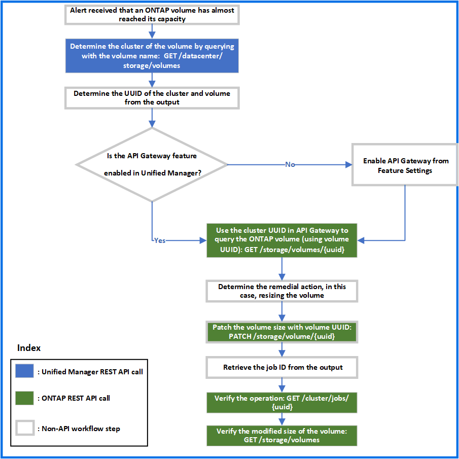

= 使用網關 API 對ONTAP磁碟區進行故障排除
:allow-uri-read: 
:icons: font
:imagesdir: ../media/

[role="lead"]
網關 API 充當網關，呼叫ONTAP API 來查詢有關ONTAP儲存物件的資訊並採取補救措施來解決報告的問題。

此工作流程採用一個範例用例，其中當ONTAP磁碟區幾乎達到其容量時會引發一個事件。此工作流程也示範如何透過呼叫Active IQ Unified Manager和ONTAP REST API 的組合來解決此問題。

[NOTE]
====
在運行工作流程步驟之前，請確保以下事項：

* 您了解網關 API 及其使用方法。有關信息，請參閱link:concept_gateway_apis.html["透過代理程式存取ONTAP API"]。
* 您了解ONTAP REST API 的用法。有關使用ONTAP REST API 的信息，請參閱https://docs.netapp.com/us-en/ontap-automation/index.html["ONTAP自動化文檔"]。
* 您是應用程式管理員。
* 您要在其上執行 REST API 操作的叢集受ONTAP 9.5 或更高版本支持，並且該叢集透過 HTTPS 新增至 Unified Manager。

====
下圖說明了解決ONTAP磁碟區容量使用問題的工作流程中的每個步驟。

此工作流程涵蓋 Unified Manager 和ONTAP REST API 的呼叫點。

. 記下通知磁碟區容量利用率的事件中的磁碟區名稱。
. 透過使用磁碟區名稱作為名稱參數中的值，透過執行以下 Unified Manager API 來查詢磁碟區。
+
[cols="3*"]
|===
| 類別 | HTTP 動詞 | 小路 

 a| 
資料中心
 a| 
得到
 a| 
`/datacenter/storage/volumes`

|===
. 從輸出中檢索叢集 UUID 和磁碟區 UUID。
. 在 Unified Manager Web UI 上，導覽至 *常規* > *功能設定* > *API 閘道* 以驗證 API 閘道功能是否已啟用。除非啟用，否則網關類別下的 API 不可供您呼叫。如果該功能已停用，請啟用它。
. 使用叢集 UUID 運行ONTAP API/`storage/volumes/{uuid}`透過API網關。當磁碟區 UUID 作為 API 參數傳遞時，查詢將傳回磁碟區詳細資料。
+
若要透過 API 閘道執行ONTAP API，Unified Manager 憑證會在內部傳遞以進行驗證，且您不需要為單一叢集存取權執行額外的驗證步驟。

+
[cols="3*"]
|===
| 類別 | HTTP 動詞 | 小路 

 a| 
統一管理器：網關

ONTAP：存儲
 a| 
得到
 a| 
網關 API： `/gateways/\{uuid}/\{path}`

ONTAP API： `/storage/volumes/\{uuid}`

|===
+
[NOTE]
====
在 /gateways/\{uuid}/\{path} 中，\{uuid} 的值必須替換為執行 REST 作業的叢集 UUID。  \{path} 必須替換為ONTAP REST URL /storage/volumes/\{uuid}。

====
+
附加的 URL 是： `/gateways/\{cluster_uuid}/storage/volumes/\{volume_uuid}`

+
執行 GET 操作時，產生的 URL 為： `GEThttps://<hostname\>/api/gateways/<cluster_UUID\>/storage/volumes/\{volume_uuid\}`

+
*範例 cURL 指令*

+
[listing]
----
curl -X GET "https://<hostname>/api/gateways/1cd8a442-86d1-11e0-ae1c-9876567890123/storage/volumes/028baa66-41bd-11e9-81d5-00a0986138f7"
-H "accept: application/hal+json" -H "Authorization: Basic <Base64EncodedCredentials>"
----
. 根據輸出，確定大小、用途和要採取的補救措施。在此工作流程中，採取的補救措施是調整磁碟區大小。
. 使用叢集 UUID 並透過 API 閘道執行以下ONTAP API 來調整磁碟區大小。有關網關和ONTAP API 的輸入參數的信息，請參閱步驟 5。
+
[cols="3*"]
|===
| 類別 | HTTP 動詞 | 小路 

 a| 
統一管理器：網關

ONTAP：存儲
 a| 
修補
 a| 
網關 API： `/gateways/\{uuid}/\{path}`

ONTAP API： `/storage/volumes/\{uuid}`

|===
+
[NOTE]
====
除了群集 UUID 和磁碟區 UUID 之外，您還必須輸入用於調整磁碟區大小的大小參數值。確保以位元組為單位輸入值。例如，如果要將磁碟區的大小從 100 GB 增加到 120 GB，請在查詢結尾輸入參數大小的值： `-d {\"size\": 128849018880}"`

====
+
*範例 cURL 指令*

+
[listing]
----
curl -X PATCH "https://<hostname>/api/gateways/1cd8a442-86d1-11e0-ae1c-9876567890123/storage/volumes/028baa66-41bd-11e9-81d5-00a0986138f7" -H
    "accept: application/hal+json" -H "Authorization: Basic <Base64EncodedCredentials>" -d
    {\"size\": 128849018880}"
----
+
JSON 輸出傳回作業 UUID。

. 使用作業 UUID 驗證作業是否成功運作。使用叢集 UUID 和作業 UUID 透過 API 閘道執行下列ONTAP API。有關網關和ONTAP API 的輸入參數的信息，請參閱步驟 5。
+
[cols="3*"]
|===
| 類別 | HTTP 動詞 | 小路 

 a| 
統一管理器：網關

ONTAP：叢集
 a| 
得到
 a| 
網關 API： `/gateways/\{uuid}/\{path}`

ONTAP API： `/cluster/jobs/\{uuid}`

|===
+
傳回的 HTTP 程式碼與ONTAP REST API HTTP 狀態碼相同。

. 執行以下ONTAP API 來查詢已調整大小的磁碟區的詳細資訊。有關網關和ONTAP API 的輸入參數的信息，請參閱步驟 5。
+
[cols="3*"]
|===
| 類別 | HTTP 動詞 | 小路 

 a| 
統一管理器：網關

ONTAP：存儲
 a| 
得到
 a| 
網關 API： `/gateways/\{uuid}/\{path}`

ONTAP API： `/storage/volumes/\{uuid}`

|===
+
輸出顯示磁碟區大小增加到了 120 GB。

