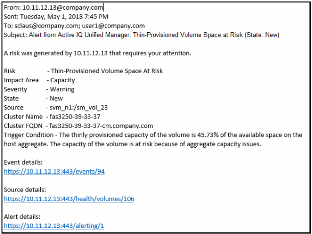

= 警報電子郵件包含哪些訊息
:allow-uri-read: 
:icons: font
:imagesdir: ../media/

[role="lead"]
Unified Manager 警報電子郵件提供事件類型、事件嚴重性、導致事件發生的策略或閾值的名稱以及事件描述。電子郵件還為每個事件提供了超鏈接，使您可以在 UI 中查看該事件的詳細資訊頁面。

警報電子郵件將發送給所有已訂閱接收警報的使用者。

如果效能計數器或容量值在收集期間發生較大變化，則可能導致針對相同閾值策略同時觸發嚴重事件和警告事件。在這種情況下，您可能會收到一封針對警告事件的電子郵件和一封針對嚴重事件的電子郵件。這是因為 Unified Manager 允許您單獨訂閱以接收警告和嚴重閾值違規的警報。

警報電子郵件範例如下所示：

