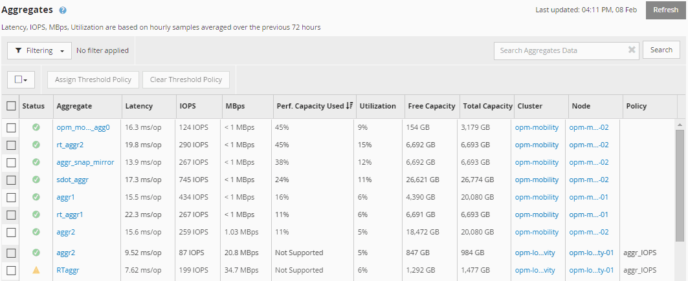

= 查看節點和聚合效能容量使用值
:allow-uri-read: 
:icons: font
:imagesdir: ../media/

[role="lead"]
您可以監控叢集中所有節點或所有聚合的效能容量使用值，也可以查看單一節點或聚合的詳細資訊。

效能容量使用值顯示在儀表板、效能清單頁面、最佳表現頁面、建立閾值策略頁面、效能資源管理器頁面和詳細圖表中。例如，「效能：所有聚合」頁面提供了「已使用效能容量」列，用於查看所有聚合的效能容量已使用值。

監視效能容量使用計數器可讓您識別以下內容：

* 任何叢集上的任何節點或聚合是否具有高效能容量使用值
* 任何叢集上的任何節點或聚合是否有活動的效能容量使用事件
* 叢集中效能容量使用值最高和最低的節點和聚合
* 延遲和利用率計數器值與具有高效能容量使用值的節點或聚合結合使用
* 如果其中一個節點發生故障，HA 對中節點的效能容量使用值將受到怎樣的影響
* 具有高效能容量使用值的聚合上最繁忙的捲和 LUN

