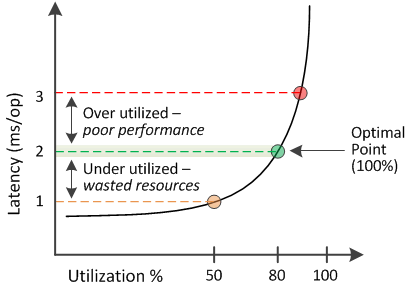

= 性能容量使用值的意義
:allow-uri-read: 
:icons: font
:imagesdir: ../media/

[role="lead"]
效能容量使用值可協助您識別目前過度利用或未充分利用的節點和聚合。這使您能夠重新分配工作負載，以提高儲存資源的效率。

下圖顯示了資源的延遲與利用率曲線，並以彩色點標示了目前操作點可能所在的三個區域。

* 效能容量使用百分比等於 100 處於最佳點。
+
目前資源正在有效利用。

* 效能容量使用百分比高於 100 表示節點或聚合體利用率過高，且工作負載的效能不佳。
+
不應為資源添加任何新的工作負載，並且可能需要重新分配現有的工作負載。

* 效能容量使用百分比低於 100 表示節點或聚合未充分利用，且資源未有效利用。
+
可以為資源增加更多工作負載。

[NOTE]
====
與利用率不同，效能容量使用百分比可以高於 100%。沒有最大百分比，但當資源過度利用時，其百分比通常會在 110% 到 140% 的範圍內。百分比越高，表示資源有嚴重問題。

====