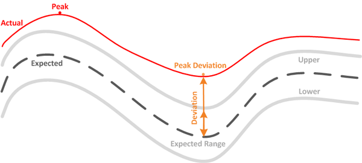

= 工作負載效能測量值
:allow-uri-read: 
:icons: font
:imagesdir: ../media/

[role="lead"]
Unified Manager 根據歷史和預期統計值來衡量叢集上工作負載的效能，這些統計值形成了工作負載的延遲預測值。它將實際工作負載統計值與延遲預測進行比較，以確定工作負載效能何時過高或過低。未如預期執行的工作負載會觸發動態效能事件來通知您。

在下圖中，紅色的實際值代表該時間範圍內的實際效能統計資料。實際值已超過效能閾值，即延遲預測的上限。峰值是時間範圍內的最高實際值。偏差衡量預期值（預測）與實際值之間的變化，而峰值偏差表示預期值與實際值之間的最大變化。

下表列出了工作負載效能測量值。

|===
| 測量 | 描述 

 a| 
活動
 a| 
策略群組中的工作負載所使用的 QoS 限制百分比。

[NOTE]
====
如果 Unified Manager 偵測到策略群組發生變更（例如新增或刪除磁碟區或變更 QoS 限制），則實際值和預期值可能會超過設定限制的 100%。如果數值超過設定限值的 100%，則顯示為 >100%。如果值小於設定限值的 1%，則顯示為 <1%。

====

 a| 
實際的
 a| 
對於給定的工作負載，在特定時間測量的效能值。

 a| 
偏差
 a| 
預期值與實際值之間的變化。它是實際值減去預期值與預期範圍上限值減去預期值的比率。

[NOTE]
====
負偏差值表示工作負載效能低於預期，而正偏差值表示工作負載效能高於預期。

====

 a| 
預期的
 a| 
預期值是基於對給定工作負載的歷史效能資料的分析。  Unified Manager 分析這些統計值以確定值的預期範圍（延遲預測）。

 a| 
延遲預測（預期範圍）
 a| 
延遲預測是對特定時間的上限和下限性能值的預測。對於工作負載延遲，上限值構成效能閾值。當實際值超過效能閾值時，Unified Manager 會觸發動態效能事件。

 a| 
頂峰
 a| 
一段時間內測得的最大值。

 a| 
峰值偏差
 a| 
一段時間內測得的最大偏差值。

 a| 
隊列深度
 a| 
在互連元件處等待的待處理 I/O 請求數。

 a| 
使用率
 a| 
對於網路處理、資料處理和聚合元件，一段時間內完成工作負載作業的繁忙時間百分比。例如，網路處理或資料處理元件處理 I/O 請求或聚合完成讀取或寫入請求的時間百分比。

 a| 
寫入吞吐量
 a| 
從本地叢集上的工作負載到MetroCluster配置中的配對叢集的寫入吞吐量，以兆位元組/秒 (MB/s) 為單位。

|===