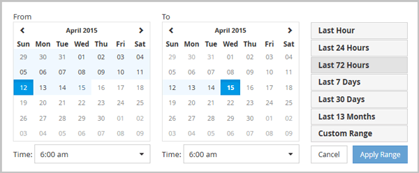

= 指定自訂時間範圍
:allow-uri-read: 
:icons: font
:imagesdir: ../media/

[role="lead"]
透過「效能資源管理器」頁面，您可以指定效能資料的日期和時間範圍。在細化叢集物件資料時，指定自訂時間範圍比使用預定義時間範圍具有更大的彈性。

您可以選擇一小時到 390 天之間的時間範圍。 13 個月等於 390 天，因為每個月算 30 天。指定日期和時間範圍可提供更多詳細信息，並使您能夠放大特定的性能事件或一系列事件。指定時間範圍也有助於解決潛在的效能問題，因為指定日期和時間範圍可以更詳細地顯示效能事件周圍的資料。使用*時間範圍*控制項選擇預先定義的日期和時間範圍，或指定您自己的自訂日期和時間範圍（最長 390 天）。預先定義時間範圍的按鈕從*過去一小時*到*過去 13 個月*不等。

選擇「*過去 13 個月*」選項或指定超過 30 天的自訂日期範圍將顯示一個對話框，提醒您超過 30 天的時間段內顯示的效能資料是使用每小時平均值而不是 5 分鐘資料輪詢繪製的。因此，可能會出現時間軸視覺粒度的損失。如果您按一下對話方塊中的「*不再顯示*」選項，則當您選擇「*過去 13 個月*」選項或指定大於 30 天的自訂日期範圍時，不會出現該訊息。如果時間範圍包含距今超過 30 天的時間/日期，則摘要資料也適用於較小的時間範圍。

選擇時間範圍（自訂或預定義）時，30 天或更短的時間範圍是根據 5 分鐘間隔資料樣本。超過 30 天的時間範圍是基於一小時間隔的資料樣本。

. 按一下「*時間範圍*」下拉框，顯示「時間範圍」面板。
. 若要選擇預先定義的時間範圍，請按一下「時間範圍」面板右側的「最後...」按鈕之一。選擇預先定義的時間範圍時，最多可獲得 13 個月的數據。您選擇的預定義時間範圍按鈕將會反白顯示，並且相應的日期和時間將顯示在行事曆和時間選擇器中。
. 若要選擇自訂日期範圍，請按一下左側「從」行事曆中的開始日期。按一下 *<* 或 *>* 可在日曆中向前或向後導覽。若要指定結束日期，請按一下右側「至」行事曆中的日期。請注意，預設結束日期是今天，除非您指定其他結束日期。時間範圍面板右側的「自訂範圍」按鈕會反白顯示，表示您已選擇自訂日期範圍。
. 若要選擇自訂時間範圍，請按一下「*從*」行事曆下方的「*時間*」控制項並選擇開始時間。若要指定結束時間，請按一下右側「*至*」日曆下方的「*時間*」控件，然後選擇結束時間。時間範圍面板右側的「自訂範圍」按鈕會反白顯示，表示您已選擇自訂時間範圍。
. 或者，您可以在選擇預定義日期範圍時指定開始時間和結束時間。選擇前面所述的預定義日期範圍，然後按前面描述選擇開始和結束時間。選定的日期在日曆中突出顯示，您指定的開始和結束時間顯示在*時間*控制項中，並且*自訂範圍*按鈕突出顯示。
. 選擇日期和時間範圍後，按一下*套用範圍*。此時間範圍的效能統計資料顯示在圖表和事件時間軸中。

