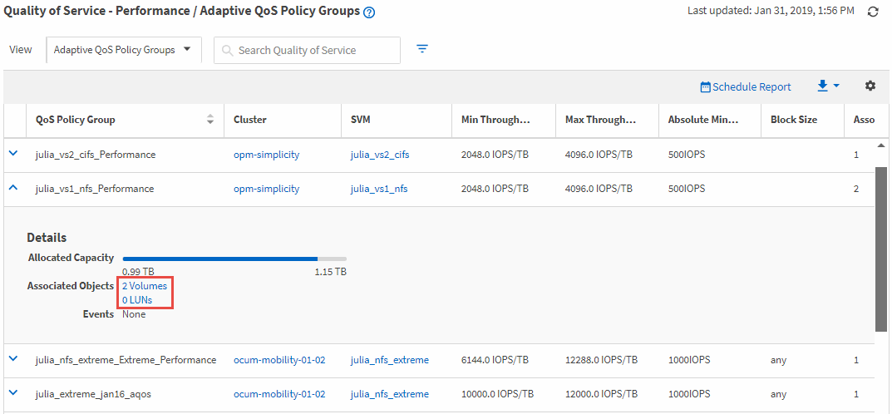

= 查看同一 QoS 策略群組中的磁碟區或 LUN
:allow-uri-read: 
:icons: font
:imagesdir: ../media/

[role="lead"]
您可以顯示已指派給相同 QoS 政策群組的磁碟區和 LUN 的清單。

對於在多個磁碟區之間「共用」的傳統 QoS 策略群組，這有助於查看某些磁碟區是否過度使用了為策略群組定義的吞吐量。它還可以幫助您決定是否可以將其他磁碟區新增至策略群組而不會對其他磁碟區產生負面影響。

對於自適應 QoS 原則和 Unified Manager 效能服務等級原則，這有助於查看使用策略群組的所有磁碟區或 LUN，以便您可以看到如果變更 QoS 原則的設定設置，哪些物件會受到影響。

.步驟
. 在左側導覽窗格中，按一下「*儲存*」>「*QoS 策略群組*」。
+
預設顯示「效能：傳統 QoS 策略群組」視圖。

. 如果您對傳統政策組感興趣，請留在此頁面。否則，請選擇其中一個附加檢視選項以顯示所有自適應 QoS 原則群組或由 Unified Manager 效能服務等級所建立的所有 QoS 原則群組。
. 在您感興趣的 QoS 策略中，按一下展開按鈕 (image:../media/chevron_down.gif["展開按鈕圖示"] ) 來查看更多詳細資訊。
. 按一下磁碟區或 LUN 連結以查看使用此 QoS 策略的物件。
+
磁碟區或 LUN 的效能清單頁面顯示使用 QoS 策略的物件的排序清單。

