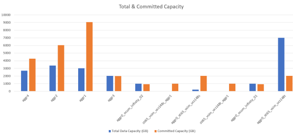

= 建立報表以顯示聚合容量表和圖表
:allow-uri-read: 
:icons: font
:imagesdir: ../media/

[role="lead"]
您可以使用總計和叢集長條圖格式在 Excel 檔案中建立報表來分析容量。

.開始之前
* 您必須具有應用程式管理員或儲存管理員角色。

使用下列步驟開啟「執行狀況：所有聚合」視圖，在 Excel 中下載視圖，建立可用容量圖表，上傳自訂 Excel 文件，並安排最終報表。

.步驟
. 在左側導覽窗格中，按一下「*儲存*」>「*聚合*」。
. 選擇*報表* > *下載 Excel*。
+
image::../media/download_excel_menu.png[顯示如何從報表下載 Excel 的 UI 螢幕截圖。]

+
根據您的瀏覽器，您可能需要按一下「*確定*」來儲存檔案。

. 如果需要，請按一下「啟用編輯」。
. 在 Excel 中開啟下載的檔案。
. 建立新工作表（image:../media/excel_new_sheet_icon.png[""] ）之後 `data`表並將其命名為*總資料容量*。
. 在新的「總資料容量」表中新增以下列：
+
.. 總數據容量（GB）
.. 承諾容量（GB）
.. 已使用數據容量（GB）
.. 可用資料容量（GB）

. 在每一列的第一行中，輸入以下公式，確保它引用資料表（資料！），並引用捕獲資料的正確列和行說明符（總資料容量從 E 列、第 2 行到第 20 行提取資料）。
+
.. =SUM（數據！E$2：數據！E$20）
.. =SUM（數據！F$2：數據！F$50）
.. =SUM（數據！G$2：數據！G$50）
.. =SUM(數據！H$2:數據！H$50)

+
此公式根據當前資料對每一列進行總計。

image::../media/capacitysums.png[資料表的 UI 螢幕截圖，顯示基於目前資料的總容量。]

. 在資料表上，選擇*總資料容量（GB）*和*承諾容量（GB）*列。
. 從*插入*選單中選擇*建議圖表*，然後選擇*簇狀長條圖*。
. 右鍵單擊圖表並選擇*移動圖表*將圖表移動到 `Total Data Capacity`床單。
. 使用選擇圖表時可用的「*設計*」和「*格式*」選單，您可以自訂圖表的外觀。
. 滿意後，儲存包含變更的檔案。請勿更改檔案名稱或位置。
+

. 在 Unified Manager 中，選擇 *報表* > *上傳 Excel*。
+
[NOTE]
====
確保您處於下載 Excel 檔案的相同視圖中。

====
. 選擇您已修改的 Excel 檔案。
. 按一下“開啟”。
. 點選“*提交*”。
+
*報表* > *上傳 Excel* 選單項目旁邊會出現一個複選標記。

+
image::../media/upload_excel.png[顯示如何將 Excel 上傳到報表的 UI 螢幕截圖。]

. 按一下“*計劃報告*”。
. 按一下「新增計劃」以新增一行至「報表計畫」頁面，以便您可以定義新報告的計畫特徵。
+
[NOTE]
====
為報告選擇 *XLSX* 格式。

====
. 輸入報告計劃的名稱並填寫其他報告字段，然後按一下複選標記 (image:../media/blue_check.gif[""] ) 位於行尾。
+
該報告將立即發送以進行測試。此後，將產生報告並透過電子郵件發送給使用指定頻率列出的收件者。

根據報告中顯示的結果，您可能需要研究如何最好地利用整個網路的可用容量。
