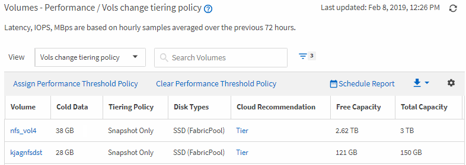

= 建立報告以識別FabricPool聚合上應將資料移至雲層的捲
:allow-uri-read: 
:icons: font
:imagesdir: ../media/

[role="lead"]
您可以建立一個報告，其中包含目前駐留在FabricPool聚合上、具有 Tier 雲端建議且具有大量冷資料的磁碟區清單。此報告可以幫助您決定是否應將某些磁碟區的分層策略變更為“自動”或“全部”，以將更多冷（非活動）資料卸載到雲層。

.開始之前
* 您必須具有應用程式管理員或儲存管理員角色。
* 您必須已配置FabricPool聚合並且在這些聚合上有磁碟區。

請依照下列步驟建立一個以正確順序顯示所需列的自訂視圖，然後排程為該視圖產生報表。

.步驟
. 在左側導覽窗格中，按一下「*儲存*」>「*磁碟區*」。
. 在「檢視」功能表中，選擇「*效能*」>「*所有磁碟區*」。
. 在列選擇器中，確保“磁碟類型”列出現在視圖中。
+
新增或刪除其他欄位以建立對您的報表很重要的視圖。

. 將「磁碟類型」列拖曳到「雲端推薦」列附近。
. 點擊過濾器圖標，添加以下三個過濾器，然後點擊*應用過濾器*：
+
** 磁碟類型包含FabricPool
** 雲端建議包含層級
** 冷數據大於 10 GBimage:../media/filter_cold_data.gif["一個 UI 螢幕截圖，顯示如何新增和套用篩選器。"]

. 按一下「冷資料」列的頂部，以便具有最多冷資料的捲出現在視圖的頂部。
. 使用名稱儲存檢視以反映檢視所顯示的內容，例如「`Vols change tiering policy`」。
. 點擊庫存頁面上的“*計劃報告*”按鈕。
. 按一下「新增計劃」以新增一行至「報表計畫」頁面，以便您可以定義新報告的計畫特徵。
. 輸入報告計劃的名稱並填寫其他報告字段，然後按一下複選標記 (image:../media/blue_check.gif[""] ) 位於行尾。
+
該報告將立即發送以進行測試。此後，將產生報告並透過電子郵件發送給使用指定頻率列出的收件者。

根據報表中顯示的結果，您可能需要使用系統管理員或ONTAP CLI 將某些磁碟區的分層策略變更為“自動”或“全部”，以將更多冷資料傳輸到雲層。
