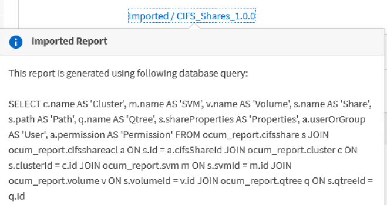

= 安排導入 .rptdesign 報告
:allow-uri-read: 
:icons: font
:imagesdir: ../media/

[role="lead"]
您可以排程在早期版本的 Unified Manager 中建立和匯入的現有報表。

安排導入報告需要以下內容：

* 在早期的 Unified Manager 版本中匯入 BIRT 設計的 .rptdesign 檔案報告
* 適用於升級至 Unified Manager 9.6 GA 或更高版本

升級至 Unified Manager 9.6 GA 或更高版本後，「報表計畫」頁面會列出匯入的報告。您可以編輯這些報告的時間表以指定收件者的電子郵件地址、頻率和格式（PDF 或 CSV）。否則，這些報告無法在 Unified Manager UI 中編輯或檢視。

.步驟
. 開啟報告計劃頁面。如果您已匯入報告，則會出現一則訊息。
+
image::../media/message_non_scehduled_reports.png[如果有匯入的報告，則會出現顯示該訊息的 UI 螢幕截圖。]

. 按一下「*檢視*」名稱以顯示用於產生報表的 SQL 查詢。
+

. 點擊更多圖標image:../media/more_icon.gif[""]，點擊*編輯*，定義報告計劃詳細信息，並儲存報告。
+
[NOTE]
====
您也可以透過「更多」圖示刪除任何不需要的報告image:../media/more_icon.gif[""]。

====

