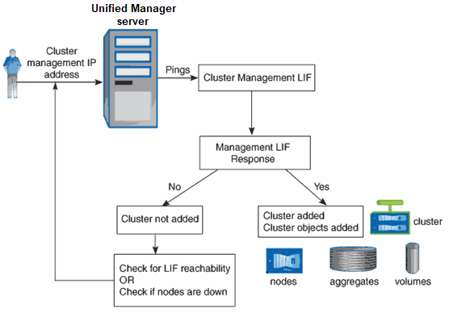

= 發現過程如何​​運作
:allow-uri-read: 
:icons: font
:imagesdir: ../media/

[role="lead"]
將叢集新增至 Unified Manager 後，伺服器會發現叢集物件並將其新增至其資料庫。了解發現過程的工作原理有助於您管理組織的集群及其物件。

預設監控間隔為 15 分鐘：如果您已將叢集新增至 Unified Manager 伺服器，則需要 15 分鐘才能在 Unified Manager UI 中顯示叢集詳細資訊。

下圖說明了Active IQ Unified Manager中的發現過程：

