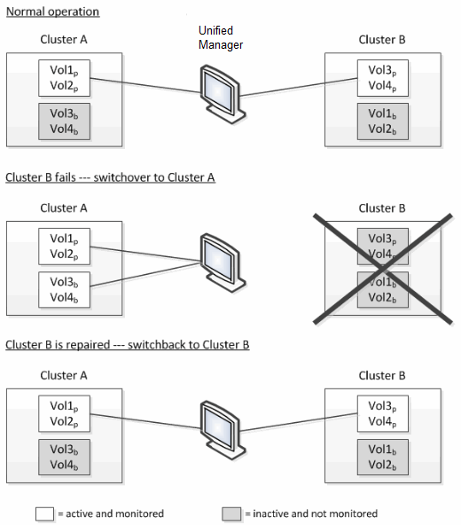

= 切換和切回期間的捲行為
:allow-uri-read: 
:icons: font
:imagesdir: ../media/

[role="lead"]
觸發切換或切回的事件會導致活動磁碟區從災難復原群組中的一個叢集移動到另一個叢集。叢集上處於活動狀態並向客戶端提供資料的磁碟區將停止，而另一個叢集上的磁碟區將啟動並開始提供資料。  Unified Manager 僅監控處於活動狀態且正在執行的磁碟區。

由於磁碟區從一個集群移動到另一個集群，因此建議您監視兩個集群。 Unified Manager 的單一實例可以監控MetroCluster配置中的兩個集群，但有時兩個位置之間的距離需要使用兩個 Unified Manager 實例來監控兩個集群。下圖顯示了 Unified Manager 的單一實例：

名稱中帶有 p 的捲表示主磁碟區，名稱中帶有 b 的磁碟區表示由SnapMirror建立的鏡像備份磁碟區。

正常運作期間：

* 集群 A 有兩個活動卷：Vol1p 和 Vol2p。
* 集群 B 有兩個活動卷：Vol3p 和 Vol4p。
* 集群 A 有兩個非活動磁碟區：Vol3b 和 Vol4b。
* 集群 B 有兩個非活動磁碟區：Vol1b 和 Vol2b。

Unified Manager 收集與每個活動卷相關的資訊（統計資料、事件等）。  Vol1p 和 Vol2p 統計資料由 Cluster A 收集，Vol3p 和 Vol4p 統計資料由 Cluster B 收集。

災難性故障導致活動卷從集群 B 切換到集群 A 後：

* 集群 A 有四個活動卷：Vol1p、Vol2p、Vol3b 和 Vol4b。
* 集群 B 有四個非活動卷：Vol3p、Vol4p、Vol1b 和 Vol2b。

與正常運作期間一樣，Unified Manager 會收集與每個活動磁碟區相關的資訊。但在這種情況下，Vol1p 和 Vol2p 統計資料由 Cluster A 收集，Vol3b 和 Vol4b 統計資料也由 Cluster A 收集。

請注意，Vol3p 和 Vol3b 不是相同的捲，因為它們位於不同的叢集上。  Unified Manager 中有關 Vol3p 的資訊與 Vol3b 的資訊不同：

* 在切換到叢集 A 期間，Vol3p 統計資料和事件不可見。
* 在第一次切換時，Vol3b 看起來像一個沒有歷史資訊的新卷。

當叢集 B 修復並執行切換時，Vol3p 在叢集 B 上再次處於活動狀態，並具有歷史統計資料和切換期間的統計資料間隙。在發生另一次切換之前，無法從叢集 A 查看 Vol3b：

image::../media/opm_mcc_volumes.gif[顯示切換期間音量行為的 UI 螢幕截圖。]

[NOTE]
====
* 處於非活動狀態的MetroCluster磁碟區（例如，切換回叢集 A 上的 Vol3b）將顯示訊息「此磁碟區已被刪除」。該卷實際上並未被刪除，但由於它不是活動卷，因此目前未被 Unified Manager 監控。
* 如果單一 Unified Manager 正在監控MetroCluster配置中的兩個集群，則磁碟區搜尋將傳回當時處於活動狀態的磁碟區的資訊。例如，如果發生了切換並且 Vol3 在群集 A 上變為活動狀態，則搜尋「Vol3」將傳回群集 A 上 Vol3b 的統計資料和事件。

====